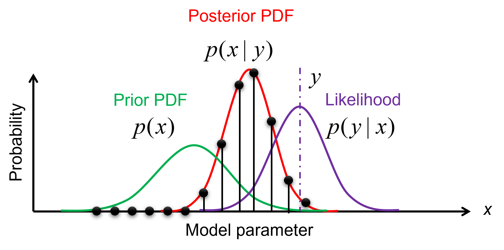
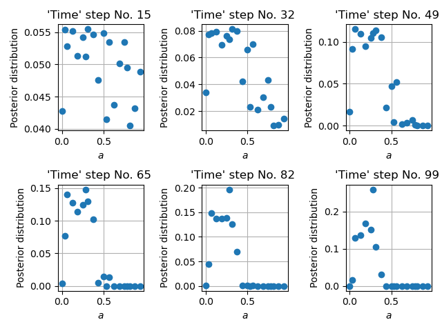
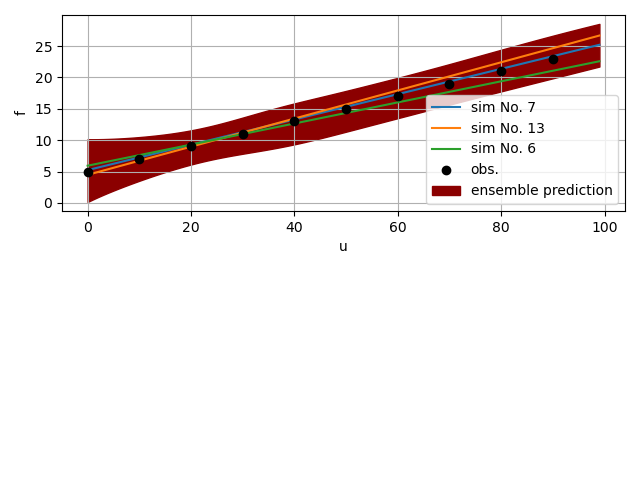

Bayesian filtering
==================

Bayesian filtering is a general framework for state estimation in dynamical systems.
In Bayesian filtering, we aim to estimate the current state of a system based on noisy observations
and a mathematical model of the system dynamics.
The state, sometimes augmented by the system's parameters, is assumed to evolve over time according to a stochastic process,
and the observations are assumed to be corrupted by random (e.g., Gaussian) noise.
The goal of the Bayesian filter is to recursively update the probability distribution of the system's state
as new observations become available, using Bayes' theorem.
The most commonly used Bayesian filters are the Kalman filter and the sequential Monte Carlo filter, also known as particle filter.

Bayes' theorem
----------------

Humans are Bayesian machines, constantly using Bayesian reasoning to make decisions and predictions about the world around them.
Bayes' theorem is the mathematical foundation for this process, allowing us to update our beliefs in the face of new evidence.

.. math::

   p(A|B) = \frac{p(B|A) p(A)}{p(B)}.

Where :math:`p(A|B)` is the **posterior** probability of hypothesis :math:`A` given evidence :math:`B` has been observed,
:math:`p(B|A)` is the **likelihood** of observing evidence :math:`B` given hypothesis :math:`A`,
:math:`p(A)` is the **prior** probability of hypothesis :math:`A`, and
:math:`p(B)` is the **prior** probability of evidence :math:`B`.

At its core, Bayes' theorem is a simple concept: the probability of a hypothesis given some observed evidence
is proportional to the product of the prior probability of the hypothesis
and the likelihood of the evidence given the hypothesis.
In other words, Bayes' theorem tells us how to update our beliefs in light of new data.
So whether we're deciding what to eat for breakfast or making predictions about the weather, we're all Bayesian at heart.

The inference module
--------------------

The :mod:`.inference` module contains classes that infer the probability
distribution of model parameters from observation data,
also known as `inverse analysis <https://en.wikipedia.org/wiki/Inverse_problem>`_ or `data assimilation <https://en.wikipedia.org/wiki/Data_assimilation>`_, in many engineering disciplines.
The output of the :mod:`.inference` module is the probability distribution of model states :math:`\vec{x}_t`, 
sometimes augmented by the parameters :math:`\vec{\Theta}`, conditioned on observation data :math:`\vec{y}_t` at time :math:`t`.

Sequential Monte Carlo
``````````````````````

The method currently available for statistical inference is :class:`Sequential Monte Carlo <.SMC>`.
It recursively updates the probability distribution of the augmented model state 
:math:`\hat{\vec{x}}_T=(\vec{x}_T, \vec{\Theta})` from the sequences of observation data
:math:`\hat{\vec{y}}_{0:T}` from time :math:`t = 0` to time :math:`T`.
The posterior distribution of the augmented model state is approximated by a set of samples,
where each sample instantiates a realization of the augmented model state.
The samples are drawn from a proposal density, which can be either informative or non-informative.

Via Bayes' rule, the posterior distribution of the augmented model state reads

.. math::

   p(\hat{\vec{x}}_{0:T}|\hat{\vec{y}}_{1:T}) \propto \prod_{t_i=1}^T p(\hat{\vec{y}}_{t_i}|\hat{\vec{x}}_{t_i}) p(\hat{\vec{x}}_{t_i}|\hat{\vec{x}}_{{t_i}-1}) p(\hat{\vec{x}}_0),

Where :math:`p(\hat{\vec{x}}_0)` is the so-called prior distribution, which is the initial distribution of the model state.
We can rewrite this equation in the recursive form, so that the posterior distribution gets updated
at every time step :math:`t`, according to

.. math::

   p(\hat{\vec{x}}_{0:t}|\hat{\vec{y}}_{1:t}) \propto p(\hat{\vec{y}}_t|\hat{\vec{x}}_t)p(\hat{\vec{x}}_t|\hat{\vec{x}}_{t-1})p(\hat{\vec{x}}_{1:t-1}|\hat{\vec{y}}_{1:t-1}),

Where :math:`p(\hat{\vec{y}}_t|\hat{\vec{x}}_t)` and :math:`p(\hat{\vec{x}}_t|\hat{\vec{x}}_{t-1})`
are the `likelihood <https://en.wikipedia.org/wiki/Likelihood_function>`_ distribution
and the `transition <https://en.wikipedia.org/wiki/Transition_probability>`_ distribution, respectively.
The likelihood distribution is the probability distribution of the observation data given the model state.
The transition distribution is the probability distribution of the model state at time :math:`t` given the model state at time :math:`t-1`.
We apply no perturbation in the parameters :math:`\vec{\Theta}` nor in the model state :math:`\vec{x}_t` over time,
because most material models describe time or history dependent behavior and are expensive to evaluate.
Therefore, the transition distribution is deterministic.

Importance sampling
:::::::::::::::::::

These distributions can be efficiently evaluated via `importance sampling <https://en.wikipedia.org/wiki/Importance_sampling>`_.
The idea is to have samples that are more important than others when approximating a target distribution.
The measure of this importance is the so-called **importance weight**.



  Illustration of importance sampling.

Therefore, we draw :attr:`samples <.DynamicSystem.param_data>`, :math:`\vec{\Theta}^{(i)} \ (i=1,...,N_p)`,
from a proposal density, leading to an ensemble of :attr:`model states <.DynamicSystem.sim_data>` :math:`\vec{x}_t^{(i)}`.
The :attr:`importance weights  <.SMC.posteriors>` :math:`w_t^{(i)}` are updated recursively, via

.. math::

   w_t^{(i)} \propto p(\hat{\vec{y}}_t|\hat{\vec{x}}_t^{(i)})p(\hat{\vec{x}}_t^{(i)}|\hat{\vec{x}}_{t-1}^{(i)}) w_{t-1}^{(i)}.

The :attr:`likelihood <.SMC.likelihoods>` :math:`p(\hat{\vec{y}}_t|\hat{\vec{x}}_t^{(i)})`
can be simply a multivariate Gaussian, which is computed by the function :attr:`~.SMC.get_likelihoods`
of the :class:`.SMC` class.

.. math::

   p(\hat{\vec{y}}_t|\hat{\vec{x}}_t^{(i)}) \propto \exp \{-\frac{1}{2}[\hat{\vec{y}}_t-\mathbf{H}(\vec{x}^{(i)}_t)]^T {\mathbf{\Sigma}_t^D}^{-1} [\hat{\vec{y}}_t-\mathbf{H}(\vec{x}^{(i)}_t)]\},

where :math:`\mathbf{H}` is the observation model that reduces to a diagonal matrix for uncorrelated observables,
and :math:`\mathbf{\Sigma}_t^D` is the covariance matrix :attr:`.SMC.cov_matrices`
calculated from :math:`\hat{\vec{y}}_t` and the user-defined normalized variance :attr:`.DynamicSystem.sigma_max`, in :attr:`.SMC.get_covariance_matrices`.

By making use of importance sampling, the posterior distribution
:math:`p(\hat{\vec{y}}_t|\hat{\vec{x}}_t^{(i)})` gets updated over time in :attr:`.SMC.data_assimilation_loop`
--- this is known as `Bayesian updating <https://statswithr.github.io/book/the-basics-of-bayesian-statistics.html#bayes-updating>`_.



  Time evolution of the importance weights over a model parameter.

Ensemble predictions
::::::::::::::::::::

Since the importance weight on each sample :math:`\vec{\Theta}^{(i)}` is discrete
and the sample :math:`\vec{\Theta}^{(i)}` and model state :math:`\vec{x}_t^{(i)}` are in a one-to-one relationship,
the ensemble mean :attr:`.DynamicSystem.estimated_params` and variance :attr:`.DynamicSystem.estimated_params_cv` can be computed as 

.. math::

   \mathrm{\widehat{E}}[f_t(\hat{\vec{x}}_t)|\hat{\vec{y}}_{1:t}] & = \sum_{i=1}^{N_p} w_t^{(i)} f_t(\hat{\vec{x}}_t^{(i)}),
   
   \mathrm{\widehat{Var}}[f_t(\hat{\vec{x}}_t)|\hat{\vec{y}}_{1:t}] & = \sum_{i=1}^{N_p} w_t^{(i)} (f_t(\hat{\vec{x}}_t^{(i)})-\mathrm{\widehat{E}}[f_t(\hat{\vec{x}}_t)|\hat{\vec{y}}_{1:t}])^2,

where :math:`f_t` describes an arbitrary quantity of interest as a function of the model's state and parameters :math:`\hat{\vec{x}}_t^{(i)}`.



  Ensemble predictions, top three fits, and the observation data


The sampling module
--------------------

The sampling module allows drawing samples from

- a non-informative uniform distribution
- a proposal density that is designed and optimized to make the inference efficient

Sampling from low-discrepancy sequences
```````````````````````````````````````

Since we typically don't know the prior distribution of model parameters,
we start with a non-informative, uniform sampling using `quasi-random <https://en.wikipedia.org/wiki/Low-discrepancy_sequence>`_
or `near-random <https://en.wikipedia.org/wiki/Latin_hypercube_sampling>`_ numbers.
We make use of the `Quasi-Monte Carlo generators of scipy <https://docs.scipy.org/doc/scipy/reference/stats.qmc.html>`_ 

You can choose to sample the parameter space from

- a `Sobol sequence <https://docs.scipy.org/doc/scipy/reference/generated/scipy.stats.qmc.Sobol.html#scipy.stats.qmc.Sobol>`_,
- a `Halton sequence <https://docs.scipy.org/doc/scipy/reference/generated/scipy.stats.qmc.Halton.html#scipy.stats.qmc.Halton>`_,
- and `a Latin Hypercube <https://docs.scipy.org/doc/scipy/reference/generated/scipy.stats.qmc.LatinHypercube.html#scipy.stats.qmc.LatinHypercube>`_,

by specifying the initial sampling method :IterativeBayesianFilter:initial_sampling when initializing the UQ method.

.. code-block:: python
   :caption: Initialize the Bayesian calibration method

   ibf_cls = IterativeBayesianFilter.from_dict(
       {
           "inference":{
               "ess_target": 0.3,
               "scale_cov_with_max": True
           },
           "sampling":{
               "max_num_components": 2
           }
           "initial_sampling": "Halton"
       }
   )

.. figure:: ./figs/qmc.png
  :width: 400
  :alt: Quasi-Monte Carlo generator

  Samples generated with the Halton sequence, Sobol sequence and Latin Hypercube sampling.

Sampling from a proposal density function
`````````````````````````````````````````

An initial uniform sampling is unbiased, but it can be very inefficient since the correlation structure is not sampled.
If we have some vague idea of the posterior distribution, we can come up with a proposal density.
For that, we can use the :class:.GaussianMixtureModel class which is a wrapper of `BayesianGaussianMixture <https://scikit-learn.org/stable/modules/generated/sklearn.mixture.BayesianGaussianMixture.html>`_ of scikit-learn.
Note that `BayesianGaussianMixture <https://scikit-learn.org/stable/modules/generated/sklearn.mixture.BayesianGaussianMixture.html>`_
is based on a variational Bayesian estimation of a Gaussian mixture,
meaning the parameters of a Gaussian mixture distribution are inferred.
For example, the number of components is optimized to fit the data, rather than an input of the Gaussian mixture.

The **non-parametric** :attr:`.GaussianMixtureModel.gmm` model can be trained with previously generated samples
and their importance weights (i.e., an approximation of the posterior distribution)
obtained from :mod:`.inference` to construct a smooth proposal density function.
New samples are then drawn from this proposal density in :attr:`.GaussianMixtureModel.regenerate_params`. 

.. figure:: figs/gmm.jpg
  :width: 600
  :alt: Resampling via a Gaussian mixture

  Resampling of parameter space via a Gaussian mixture model.

Iterative Bayesian filter
-------------------------

The `iterative Bayesian filtering algorithm <https://doi.org/10.1016/j.cma.2019.01.027>`_ combines sequential Monte Carlo filtering for inference
and non-parametric Gaussian mixtures for (re)sampling.
Sequential Monte Carlo combined with quasi- or near-random sequence sampling
leads to the so-called sequential quasi-Monte Carlo (SQMC) filter with the necessary number of samples proportional to :math:`d\log{d}`.
Although the SQMC filter is unbiased, it is very inefficient and ensured to degenerate as time proceeds.

The idea of iterative Bayesian filtering is to solve the inverse problem all over again,
from time :math:`0` to :math:`T` with new samples drawn from a more sensible proposal density,
effectively performing multi-level resampling to avoid weight degeneracy and improve efficiency. 
The essential steps include

1. :attr:`.IterativeBayesianFilter.initialize` generates the initial samples using a low-discrepancy sequence.
2. Currently, :attr:`.IterativeBayesianFilter.inference` uses :class:`.SMC` to quantify the evolution of the posterior distribution of model parameters over time.
3. When running :class:`.SMC` filtering via :attr:`.IterativeBayesianFilter.run_inference`, it is crucial to ensure that the effective sample size is large enough, so that the ensemble does not degenerate into a few samples with very large weights and :class:`.GaussianMixtureModel` are trained with sufficient data.
4. :attr:`.IterativeBayesianFilter.run_sampling` generates new samples from :class:`.GaussianMixtureModel` as the proposal density, trained with the previous ensemble (i.e., samples and associated weights).
5. :attr:`.IterativeBayesianFilter.solve` combines the steps above and is used by :mod:`BayesianCalibration` for high-level operations, such as :attr:`.BayesianCalibration.run_one_iteration`, :attr:`.BayesianCalibration.load_and_run_one_iteration`, etc.

.. figure:: ./figs/IBF.png
  :width: 600
  :alt: Iterative Bayesian filtering

  Workflow of iterative Bayesian Filtering
