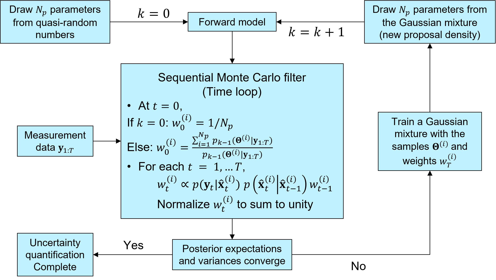

Iterative Bayesian Filter
=========================

The `iterative Bayesian filtering algorithm <https://doi.org/10.1016/j.cma.2019.01.027>`_ combines sequential Monte Carlo filtering for inference
and non-parametric Gaussian mixtures for (re)sampling.
Sequential Monte Carlo combined with quasi- or near-random sequence sampling
leads to the so-called sequential quasi-Monte Carlo (SQMC) filter with the necessary number of samples proportional to :math:`d\log{d}`.
Although the SQMC filter is unbiased, it is very inefficient and ensured to degenerate as time proceeds.

The idea of iterative Bayesian filtering is to solve the inverse problem all over again,
from time :math:`0` to :math:`T` with new samples drawn from a more sensible proposal density,
effectively performing multi-level resampling to avoid weight degeneracy and improve efficiency. 
The essential steps include

1. :attr:`.IterativeBayesianFilter.initialize` generates the initial samples using a low-discrepancy sequence.
2. Currently, :attr:`.IterativeBayesianFilter.inference` uses :class:`.SMC` to quantify the evolution of the posterior distribution of model parameters over time.
3. When running :class:`.SMC` filtering via :attr:`.IterativeBayesianFilter.run_inference`, it is crucial to ensure that the effective sample size is large enough, so that the ensemble does not degenerate into a few samples with very large weights and :class:`.GaussianMixtureModel` are trained with sufficient data.
4. :attr:`.IterativeBayesianFilter.run_sampling` generates new samples from :class:`.GaussianMixtureModel` as the proposal density, trained with the previous ensemble (i.e., samples and associated weights).
5. :attr:`.IterativeBayesianFilter.solve` combines the steps above and is used by :mod:`CalibrationToolbox` for high-level operations, such as :attr:`.CalibrationTool.run_one_iteration`, :attr:`.CalibrationTool.load_and_run_one_iteration`, etc.

  Workflow of iterative Bayesian Filtering
