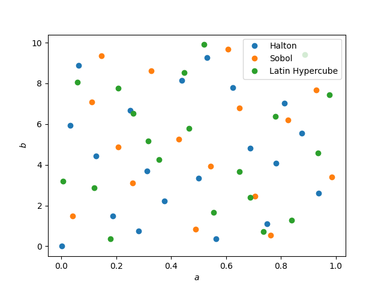

Sampling
========

The sampling module allows drawing samples from

- a non-informative uniform distribution
- a proposal density that is designed and optimized to make the inference efficient

Sampling from low-discrepancy sequences
---------------------------------------

Since we typically don't know the prior distribution of model parameters,
we start with a non-informative, uniform sampling using `quasi-random <https://en.wikipedia.org/wiki/Low-discrepancy_sequence>`_
or `near-random <https://en.wikipedia.org/wiki/Latin_hypercube_sampling>`_ numbers.
We make use of the `Quasi-Monte Carlo generators of scipy <https://docs.scipy.org/doc/scipy/reference/stats.qmc.html>`_ 

You can choose to sample the parameter space from

- a `Sobol sequence <https://docs.scipy.org/doc/scipy/reference/generated/scipy.stats.qmc.Sobol.html#scipy.stats.qmc.Sobol>`_,
- a `Halton sequence <https://docs.scipy.org/doc/scipy/reference/generated/scipy.stats.qmc.Halton.html#scipy.stats.qmc.Halton>`_,
- and `a Latin Hypercube <https://docs.scipy.org/doc/scipy/reference/generated/scipy.stats.qmc.LatinHypercube.html#scipy.stats.qmc.LatinHypercube>`_,

by specifying the initial sampling method :IterativeBayesianFilter:initial_sampling when initializing the UQ method.

.. code-block:: python
   :caption: Initialize the Bayesian calibration method

   ibf_cls = IterativeBayesianFilter.from_dict(
       {
           "inference":{
               "ess_target": 0.3,
               "scale_cov_with_max": True
           },
           "sampling":{
               "max_num_components": 2
           }
           "initial_sampling": "Halton"
       }
   )

  Samples generated with the Halton sequence, Sobol sequence and Latin Hypercube sampling.

Sampling from a proposal density function
-----------------------------------------

An initial uniform sampling is unbiased, but it can be very inefficient since the correlation structure is not sampled.
If we have some vague idea of the posterior distribution, we can come up with a proposal density.
For that, we can use the :class:.GaussianMixtureModel class which is a wrapper of `BayesianGaussianMixture <https://scikit-learn.org/stable/modules/generated/sklearn.mixture.BayesianGaussianMixture.html>`_ of scikit-learn.
Note that `BayesianGaussianMixture <https://scikit-learn.org/stable/modules/generated/sklearn.mixture.BayesianGaussianMixture.html>`_
is based on a variational Bayesian estimation of a Gaussian mixture,
meaning the parameters of a Gaussian mixture distribution are inferred.
For example, the number of components is optimized to fit the data, rather than an input of the Gaussian mixture.

The **non-parametric** :attr:`.GaussianMixtureModel.gmm` model can be trained with previously generated samples
and their importance weights (i.e., an approximation of the posterior distribution)
obtained from :mod:`.inference` to construct a smooth proposal density function.
New samples are then drawn from this proposal density in :attr:`.GaussianMixtureModel.regenerate_params`. 

.. figure:: figs/gmm.jpg
  :width: 600
  :alt: Resampling via a Gaussian mixture

  Resampling of parameter space via a Gaussian mixture model.
